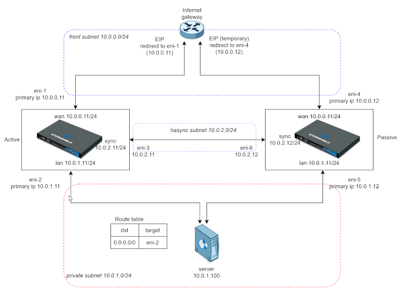

# Deployment of SNS EVA HA cluster on Outscale in existing VPC

# Introduction

This Terraform script deploys a SNS EVA high availability cluster on Outscale in a single availability zone in an existing VPC.



# Requirements

* Terraform
* Outscale Terraform Provider
* Outscale VPC with 3 subnets, an Internet Gateway, a default route table with a default route

##  configuration 

 * Edit the variable template terraform.tfvars.example

> `$ cp terraform.tfvars.example terraform.tfvars`
 
* add your Outscale access key/secret and key pair name to terraform.tfvars
* configure three networks:
  - Public : Internet facing subnet
  - Private: subnet with the assets to protect
  - Sync: subnet dedicated to appliances synchronisation

## Deployment

```
$ terraform apply
$ terraform apply
```

Note: The two apply commands are necessary for the source/dest check parameter.

Terraform outputs the main eip of the cluster and the temporary eip for the second EVA VM.

## Cluster creation

* Connect to both VM web gui to install licences/init kit.
* Create the HA cluster on the first EVA VM
```
 > CONFIG HA CREATE ifname=sync password=<secretpassword>
 100 code=00101e00 msg="Success"
 > CONFIG HA activate
 100 code=00a00100 msg="Ok"
```
* Connect to the firt EVA VM via SSH and remove the forced mac from the /usr/Firewall/ConfigFiles/network file. Delete or comment the `MacAddress` token of the `ethernet0` and `ethernet2` sections.

* Connect to the second EVA VM via the web gui and join the cluster on EVA2
 ```
 > CONFIG HA JOIN ip=10.0.2.11 password=<secretpassword>
 100 code=00101e00 msg="Success"
 > CONFIG HA Activate
 103 code=00102700 msg="rebooting..."
 Leaving client...
```
* Delete the temporary EIP for EVA2 which is no longer used

* Connect to the cluster IP via https, the high availability monitoring will update the cluster status after the second VM reboot.


## Clean-up

To remove all deployed ressources:
```
 $ terraform destroy
```

