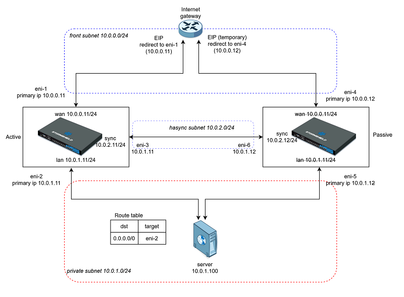

# Deployment of SNS EVA HA cluster on Outscale

# Introduction

This Terraform script deploys a SNS EVA high availability cluster on Outscale in a single availability zone.



# Requirements

* Terraform
* Outscale Terraform Provider
* SNS version 4.7.1 or greater

##  Configuration 

 * Edit the variable template terraform.tfvars.example

> `$ cp terraform.tfvars.example terraform.tfvars`
 
 * add your Outscale access key/secret and key pair name to terraform.tfvars
 * Initialize the terraform project:

> `$ terraform init`

## Deployment

```
$ terraform apply
$ terraform apply
```

Note: The two consecutive apply commands are necessary for the source/dest check parameter.

Terraform outputs the main eip of the cluster and the temporary eip for the second EVA VM.

## Cluster creation

* Connect to both VM web gui to install licences/init kit.
* Create the HA cluster on the first EVA VM via the CLI.
```
 > CONFIG HA CREATE ifname=sync password=<secretpassword> Unicast=1 SynchronizeMacAddress=0
 100 code=00101e00 msg="Success"
 > CONFIG HA activate
 100 code=00a00100 msg="Ok"
```
* For firmware version lesser than 4.7.1, the Unicast and SynchronizeMacAddress options don't exist. It is necessary to delete the forced mac address from the configuration. Via SSH access edit `/usr/Firewall/ConfigFiles/network` file and delete or comment the `MacAddress` tokens of the `ethernet0` and `ethernet2` sections.

* Connect to the second EVA VM via the web gui and join the cluster on EVA2
 ```
 > CONFIG HA JOIN ip=10.0.2.11 password=<secretpassword>
 100 code=00101e00 msg="Success"
 > CONFIG HA Activate
 103 code=00102700 msg="rebooting..."
 Leaving client...
```
* Delete the temporary EIP for EVA2 which is no longer used

* Connect to the cluster IP via https, the high availability monitoring will update the cluster status after the second VM reboot.

## Test procedure

* connect to the protected server using ssh port 2222
```
 $ ssh -i <private-key.pem> -p 2222 outscale@<cluster eip>
```
* Launch a HA swap by rebooting the active VM of the cluster.
* The ssh session is not interupted.

## Clean-up

To remove all deployed ressources:
```
 $ terraform destroy
```

